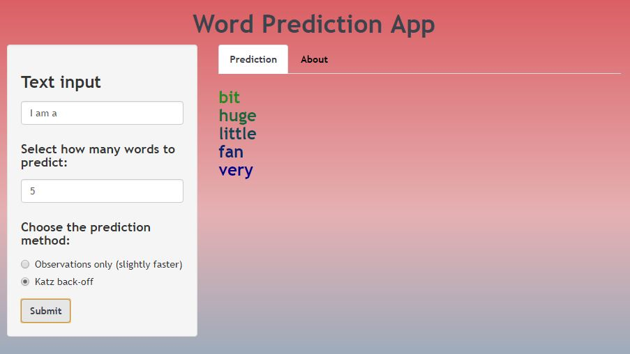

```{r setup, include = FALSE}
knitr::opts_chunk$set(echo = FALSE)
```

## Word Prediction App explanation

This RStudio Shiny app, named **Word Prediction App**, was created for the course project of Data Science Capstone on Coursera. It takes a phrase as input and returns the next word for that phrase based on the last n-gram; i.e., it uses an n-gram model as language model to predict with, which goes from 3-grams to 1-grams (and even blank text).

To make a prediction, the user must type a phrase and preferably how many words to predict, set by default to 4. There are two options for the model to make the prediction: observations only, or Katz back-off, which discounts some probability mass of higher n-grams when backing off to lower n-grams. The former is set by default.

There is no need for the user to care about numbers, symbols, punctuation or profanity in the input, because the app will handle it internally.

## Algorithm explanation

Prediction based on **observations only**, as its name suggests, returns the most frequent words that complete observed n-grams. The predictor function first gathers the last 3-gram of the input text, returns the observed 4-grams that start with said 3-gram, and isolates the last word of every 4-gram sorting them by frequency. If the number of observed 4-grams is less than the input number of words to predict, it then gathers the last 2-gram of the input text, returns the observed 3-grams that start with said 2-gram, and follows the same procedure. If the sum of observed 4-grams and observed 3-grams is still less than the input number of words to predict, it moves on to the last 1-gram of the input text and does the same process. Lastly, if the sum of observed 4-grams, 3-grams and 2-grams is less than the input number of words to predict, it will add the most observed 1-grams to the current data frame.

**Katz back-off** prediction follows a similar procedure as prediction based on observations only. When obtaining the observed 4-grams that start with the last 3-gram, some discount is made on the frequencies of observed 4-grams, which accounts for unseen 4-grams. The leftover probability mass of 4-grams goes to observed 3-grams. Then, for observed 3-grams that start with the last 2-gram, some discount is made on the frequencies of observed 3-grams, accounting for unseen 3-grams. The same process is done for observed 2-grams that start with the last 1-gram, and the probability mass that goes to 1-grams is the leftover probability from 2-grams.

Note that, when prediction is based on observations only, observed n-grams of higher order have priority over observed n-grams of lower order, which is not always the case for Katz back-off. In fact, the discounts of observed n-grams are hyper-parameters, and the final predictions may differ between the two options.

## Accuracy

The test set to evaluate the accuracy of the model consisted of almost 9000 3-grams, which are about 0.01% of the original combined corpora 3-grams. The 4-grams of the corpora corresponding to the test set 3-grams were also gathered, and their final words were isolated in order to compare them with the predicted words. That being the case, the accuracy on the **first predicted word** using this test set was approximately **14%**, whereas the accuracy on the **first four predicted words** was approximately **25%**.

The data used to build the n-gram model were data frames of observed n-grams and their frequencies, with n from 1 to 4. It was seen that a lot of n-grams were observed very rarely, so they were removed to make the model lighter. This procedure not only decreases the model size, but also helps avoid overfitting. In this sense, some thresholds were set for the observed n-grams: 50 for 1-grams, 10 for 2-grams, and 3 for 3-grams and 4-grams. Therefore, every observed n-gram whose frequency was less than the threshold was removed from the model. Also, it must be kept in mind that the size of the model is only 15 Mb, which is appropriate for an app to be run online.

Regarding Katz back-off, the discounts on the frequencies of observed n-grams were 2 for 3-grams and 4-grams, and 5 for 2-grams. These values still give higher n-grams priority over lower n-grams, but this approach is not as stiff as the prediction based on observations only.

## Results and app page

Results are displayed on the "Prediction" tab after clicking the "Submit" button. The **most likely** words are shown at the **top** and are colored **<span style="color:forestgreen">forest green</span>**, whereas the **less likely** words are shown at the **bottom** and are colored **<span style="color:darkblue">dark blue</span>**.

Here is an example of word prediction after clicking "Submit" for "**I am a**" as input text, **5** as number of words to predict, and prediction using **Katz back-off**:


The app is currently stored on a webpage hosted by the shinyapps.io server: <https://johan-vm.shinyapps.io/WordPrediction/>.

The .R files (model, global.R, server.R and ui.R) can be found on the GitHub repository: <https://github.com/Johan-VM/DataScienceCapstone>.
